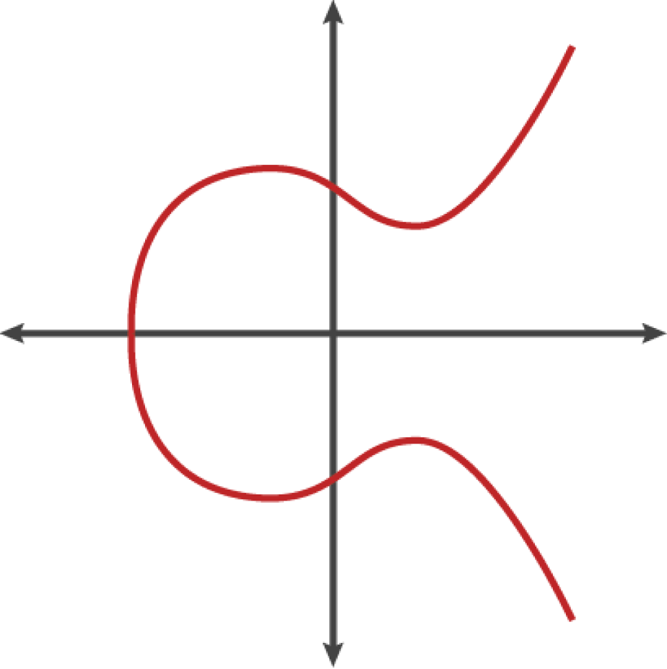

# 키, 주소, 지갑

<https://www.oreilly.com/library/view/mastering-bitcoin/9781491902639/ch04.html>

</br>

## 개인 키와 공개 키

비트코인 지갑에는 각각 개인 키와 공개 키로 구성된 키 쌍 컬렉션이 들어 있습니다. </br>
**개인 키(k)** 는 일반적으로 무작위로 선택된 숫자입니다. 개인 키에서 타원 곡선 곱셈, 일방향 암호화 함수를 사용하여 공개 키(K)를 생성합니다. </br>
**공개 키(K)** 에서 일방향 암호화 해시 함수를 사용하여 비트코인 ​​주소(A)를 생성합니다. 이 섹션에서는 개인 키 생성부터 시작하여 이를 공개 키로 바꾸는 데 사용되는 타원 곡선 수학을 살펴보고 마지막으로 공개 키에서 비트코인 ​​주소를 생성합니다. 


그림 0. 개인키, 공개키, 비트코인 ​​주소

</br>

## 개인 키

개인 키는 단순히 무작위로 선택된 숫자입니다. 개인 키에 대한 소유권과 제어는 해당 비트코인 ​​주소와 관련된 모든 자금에 대한 사용자 제어의 근원입니다. </br>
개인 키는 거래에 사용된 자금의 소유권을 증명하여 비트코인을 지출하는 데 필요한 서명을 만드는 데 사용됩니다. 개인 키는 항상 비밀로 유지되어야 합니다. 개인 키를 제3자에게 공개하는 것은 해당 키로 보호되는 비트코인에 대한 제어권을 제3자에게 부여하는 것과 같기 때문입니다. </br>
개인 키는 또한 백업하고 우발적 손실로부터 보호해야 합니다. 개인 키를 분실하면 복구할 수 없고 개인 키로 보호되는 자금도 영원히 손실되기 때문입니다.

</br>

```
비트코인 개인 키는 단지 숫자일 뿐입니다. 동전, 연필, 종이만 사용하여 개인 키를 무작위로 선택할 수 있습니다. 동전을 256번 던지면 비트코인 ​​지갑에서 사용할 수 있는 무작위 개인 키의 이진수가 나옵니다. 그런 다음 개인 키에서 공개 키를 생성할 수 있습니다.
```

### 난수에서 개인 키 생성

키 생성에서 가장 중요한 첫 번째 단계는 엔트로피 또는 무작위성의 안전한 소스를 찾는 것입니다. </br>
비트코인 ​​키를 만드는 것은 본질적으로 "1과 $2^{256}$ 사이의 숫자를 고르세요 "와 같습니다. 예측 가능하거나 반복 가능하지 않은 한 그 숫자를 고르는 데 사용하는 정확한 방법은 중요하지 않습니다. </br>
비트코인 ​​소프트웨어는 기본 운영 체제의 난수 생성기를 사용하여 256비트의 엔트로피(무작위성)를 생성합니다. 일반적으로 OS 난수 생성기는 인간의 무작위성 소스에 의해 초기화되므로 몇 초 동안 마우스를 흔들어 보라고 요청받을 수 있습니다. 진정으로 편집증이 있는 사람에게는 주사위, 연필, 종이보다 더 좋은 것은 없습니다.</br>
</br>

### 다음은 16진수 형식(256개의 2진 숫자를 64개의 16진 숫자로 표시, 각각 4비트)으로 표시된 무작위로 생성된 개인 키(k)입니다.

```
1E99423A4ED27608A15A2616A2B0E9E52CED330AC530EDCC32C8FFC6A526AEDD
```

</br>

```
비트코인의 개인 키 공간 크기인 2,256 은 헤아릴 수 없을 만큼 큰 숫자입니다. 십진수로 약 10 77 입니다 . 눈에 보이는 우주에는 10 80개의 원자가 들어 있다고 추정됩니다.
```

</br>

## 공개 키

공개 키는 타원 곡선 곱셈을 사용하여 개인 키에서 계산되며 이는 되돌릴 수 없습니다. </br>
$$ K = k * G $$

여기서 소문자 k 는 개인 키이고, G는 생성자 점 이라고 하는 상수 점이고 , 대문자 K 는 결과 공개 키입니다. "이산 대수 찾기"로 알려진 역 연산( K를 알고 있다면 k 를 계산하는 것 )은 가능한 모든 값을 시도하는 것만큼 어렵습니다. 즉, 무차별 대입 검색입니다. 개인 키에서 공개 키를 생성하는 방법을 보여주기 전에 타원 곡선 암호화를 조금 더 자세히 살펴보겠습니다.

## 타원 곡선 암호화에 대한 설명


타원 곡선 암호학은 타원 곡선의 점에서의 덧셈과 곱셈으로 표현되는 이산대수 문제를 기반으로 하는 비대칭 또는 공개 키 암호학의 한 유형입니다.



그림1. 타원 곡선

비트코인은 미국 국립표준기술연구소(NIST)에서 제정한 secp256k1이라는 표준에 정의된 특정 타원 곡선과 수학 상수 집합을 사용합니다. secp256k1 곡선은 타원 곡선을 생성하는 다음 함수에 의해 정의됩니다: </br>


or


mod p (소수 p에 대한 모듈러)는 이 곡선이 소수 차수 p를 가진 유한체 위에 있다는 것을 나타내며, 이는 $\mathbb{F}_p$로도 쓰입니다. </br>
여기서 
\[
p = 2^{256} - 2^{32} - 2^9 - 2^8 - 2^7 - 2^6 - 2^4 - 2^2 - 1
\] 
로 매우 큰 소수입니다. </br>
</br>

이 곡선은 실수가 아닌 소수 차수의 유한체에 정의되어 있기 때문에 2차원에 흩어져 있는 점들의 패턴처럼 보이므로 시각화하기 어렵습니다. 그러나 수학은 실수 위에 타원 곡선을 그리는 것과 동일합니다.</br>
예를 들어, 그림 4-3은 훨씬 작은 소수 차수 17의 유한 필드에서 동일한 타원 곡선을 그리드에 점의 패턴으로 보여줍니다. </br>
secp256k1 비트코인 타원 곡선은 헤아릴 수 없을 정도로 큰 격자 위에 훨씬 더 복잡한 점들의 패턴으로 생각할 수 있습니다.</br>
</br>
